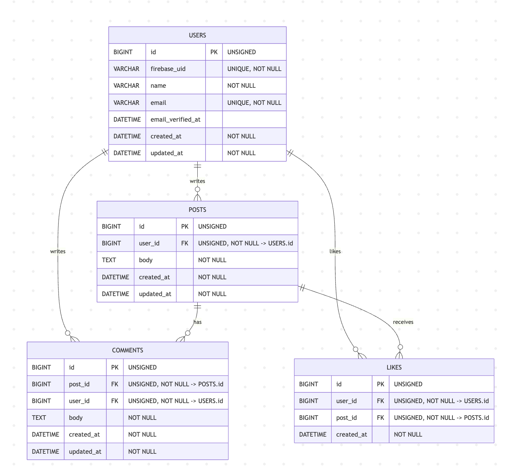

# アプリケーション名

SNSアプリ

-----

# セットアップ手順

-----

## セットアップ

### 1. リポジトリのクローン

まず、プロジェクトのリポジトリをローカルにクローンし、ディレクトリに移動します。

```bash
git clone git@github.com:matsuoka1985/sns-app.git
cd sns-app
```

### 2. Firebase 管理SDKの秘密鍵を配置

1. [Firebaseコンソール](https://console.firebase.google.com/project/sns-app-23ac6/overview) > プロジェクト設定 > サービスアカウント > **新しい秘密鍵を生成** から JSON をDL。
2. DLしたファイルを `backend/storage/app/firebase/firebase-adminsdk.json` として配置。

### 3. Dockerコンテナの起動

```bash
docker compose up -d --build
```

### 4. PHPコンテナへアクセス

PHPコンテナのシェルに入るには、以下のコマンドを使用します。

```bash
docker compose exec php bash
```

### 5. 初期セットアップ

phpコンテナにログインした状態において以下のコマンドを実行することでcomposer installによるvendorディレクトリの作成、.envファイルの作成、APP_KEYの生成、マイグレーション、シーディングが一括で実行できます。
```bash
make setup
```


-----

## テスト

### 1. PHPUnitテスト（Laravel）の実行

```bash
# phpコンテナ内で実行
docker compose exec php php artisan test
```

### 2. Vitestテスト（Nuxt.js）の実行

```bash
# nuxtコンテナ内で実行
docker compose exec nuxt npm run test
```

-----

## アクセス情報

全てのコンテナが起動し、アプリケーションのセットアップが完了すると、以下のURLで各サービスにアクセスできます。

* **Nuxt.js フロントエンド**: [http://localhost:3000](http://localhost:3000)
* **Laravel API**: [http://localhost:80](http://localhost:80)
* **phpMyAdmin (データベース管理GUIツール UI)**: [http://localhost:8080](http://localhost:8080)
* **Redis**: localhost:6379

### テスト用アカウント情報

以下の認証データによってテストアカウントでログインできます：

- メールアドレス: `dev@invalid.test`
- パスワード: `password`

---

## 使用技術(実行環境)

### バックエンド
* PHP 8.2.28
* Laravel 11.31
* MySQL 8.0.37
* Redis 7.0.11
* nginx 1.21.1

### フロントエンド
* Nuxt.js 3.17.5
* Vue.js 3.5.17
* TypeScript 5.8.3
* Node.js 22.9.0

### その他
* Firebase Authentication
* Vitest (フロントエンドテスト)
* PHPUnit (バックエンドテスト)


---

## API仕様

### 認証
- `POST /api/register` - ユーザー登録
- `POST /api/login` - ログイン
- `POST /api/logout` - ログアウト

### 投稿
- `GET /api/posts` - 投稿一覧取得
- `POST /api/posts` - 投稿作成
- `GET /api/posts/{id}` - 投稿詳細取得
- `DELETE /api/posts/{id}` - 投稿削除
- `POST /api/posts/{id}/restore` - 投稿復元

### いいね
- `POST /api/posts/{id}/like` - いいね追加・削除

### コメント
- `GET /api/posts/{id}/comments` - コメント一覧取得
- `POST /api/posts/{id}/comments` - コメント作成

---

## ディレクトリ構成

```
sns-app/
├── backend/                 # Laravel API
│   ├── app/
│   ├── database/
│   ├── tests/
│   └── ...
├── frontend/                # Nuxt.js フロントエンド
│   ├── components/
│   ├── pages/
│   ├── composables/
│   ├── tests/
│   └── ...
├── docker/                  # Docker設定
│   ├── php/
│   ├── nginx/
│   ├── mysql/
│   └── ...
├── docker-compose.yml
└── README.md
```

## ER図


